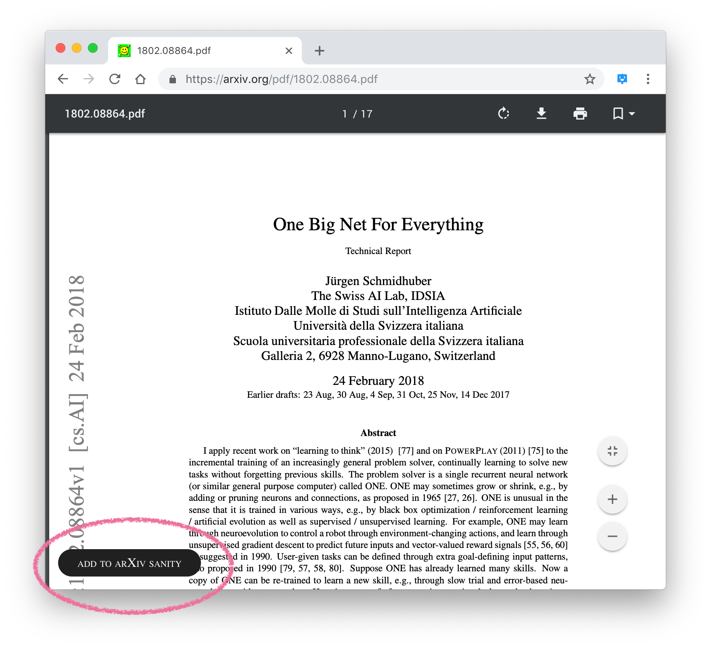

Adds a button to save arXiv PDFs in your arXiv-sanity library, because I kept clicking links on Twitter and forgetting to save the papers.

---

### Installation

Follow steps [1, 2, and 3 here](https://developer.chrome.com/extensions/getstarted#manifest).

### TODO

- [x] Some indication when the request was successful
- [ ] Testing
- [ ] Error handling
- [ ] Cleanup of the button injection code (capturing mouse events in the PDF viewer to hide/show the button is non-trivial, and the current "fix" is a hack)
- [ ] Add an icon and otherwise improve the manifest
